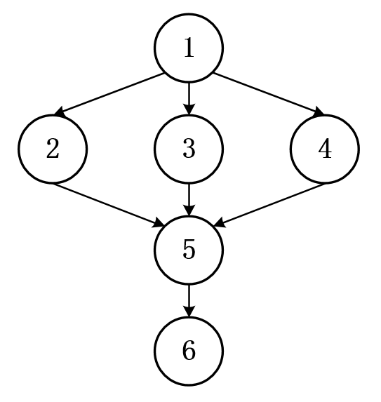

# Memory reuse algorithms
## (1) Introduction

We have implemented three algorithms in C.   

  - Large tensor first: A reuse algorithm that determines the order of tensor memory allocation in descending order of tensor size.  

  - Short lifetime first: A reuse algorithm that determines the order of tensor memory allocation in ascending order of lifetime length.

  - Eager reuse: Our algorithm, a reuse algorithm generated by exploiting lifetime relative position relationships between tensors.  

For the large tensor first algorithm, we implemented two versions: v2, v1. Compared with v1, v2 always has better performance. We use v2 for testing by default, while v1 is also in the test.c.    


## (2) Evaluation Platform

We are simulating based on C language, and gcc environment is enough. Ubuntu 22.04 is recommended.


## (3) how to compile

```
$ make
```


## (4) how to test

```
$ ./test.sh
```
Simple results output in screen, More details can be viewed in 'result/'.


## (5) how to change graph

Modify the content of 'input/input0', the format is as follows:
We use Figure 1 as an example for illustration.


Each line includes node ID, its output tensor size,  the number of adjacent nodes. if the number is greater than zero, the subsequent number represents the ID of adjacent node.

|Node_ID|Tensor_size|Adjacent_nodes_num|Adjacent_nodes_id|
|:---:|:---:|:---:|:---:|
|1|5|3|2 3 4|
|2|3|1|5|
|3|3|1|5|
|4|3|1|5|
|5|1|1|6|
|6|0|0||

  - note1: The number of Adjacent_nodes_id depends on the Adjacent_nodes_num.
  - note2: Our algorithm supports the scheduling order of breadth search by default, and more scheduling algorithm support belongs to our future work.

After change the graph and test it, the result can be viewed in 'result/result0'. 
